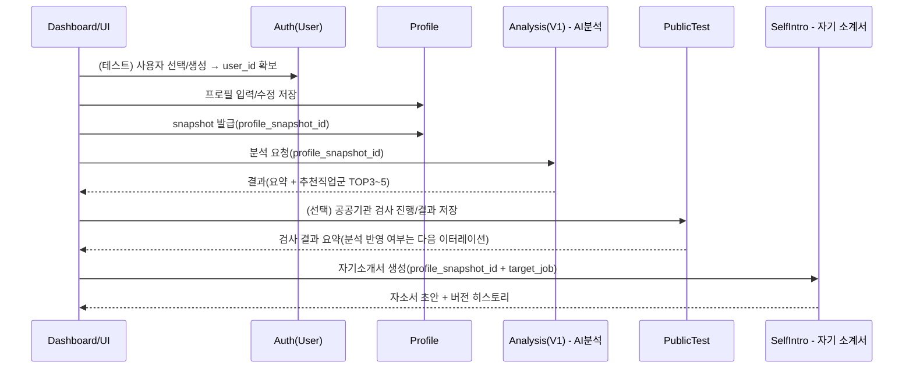

## 1) 전체 아키텍처 구조도(v0.1)
```mermaid
flowchart LR
  U[User Web UI\nDashboard] --> BFF[BFF or Web Server\n(Thymeleaf/Controller)]
  
  BFF --> AUTH[Auth/User Service\n(test: app_user)]
  BFF --> PROF[Profile Service\n(입력 표준화)]
  BFF --> TEST[Public Test Service\n(공공기관 검사 연동)]
  BFF --> ANAL[Career Analysis V1\n(심리검사 없이도 동작)]
  BFF --> SI[Self-Intro AI Service\n(자기소개서 생성)]

  AUTH --> DBU[(DB: app_user)]
  PROF --> DBP[(DB: profile + master + snapshot)]
  TEST --> DBT[(DB: test_session + test_result)]
  ANAL --> DBA[(DB: analysis_history)]
  SI --> DBS[(DB: self_intro_history)]

```
> ### **대시보드(BFF/웹)**는 “조립자” 역할만 하고, 기능은 전부 독립 서비스로 분리
>>모든 연동은 user_id와 profile_snapshot_id 중심으로 고정
---

## 2) 기능 파이프라인 구조도(v0.1)

---
## 3).파이프라인/아키텍처 구조도 v0.2 (Kompass 제외)
```mermaid
flowchart LR
  UI[Dashboard/UI] --> U[User(Test Login)]
  UI --> P[Profile Service]
  UI --> A[Career Analysis V1]
  UI --> T[Public Test Integration]
  UI --> S[Self-Intro AI]

  U --> DBU[(app_user)]
  P --> DBP[(profile + master + snapshot)]
  A --> DBA[(analysis_history)]
  T --> DBT[(test_result)]
  S --> DBS[(self_intro_history)]

```
