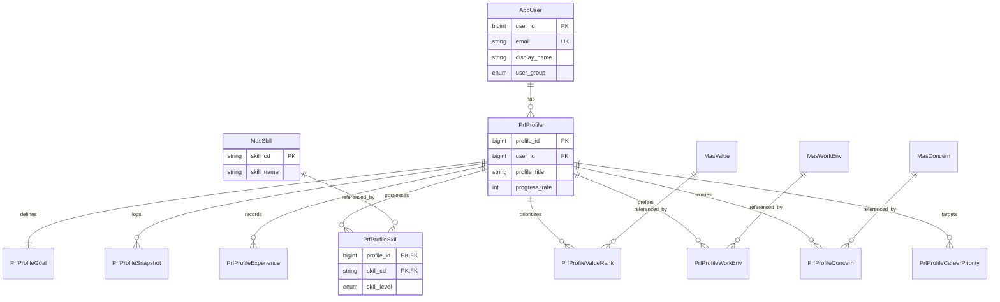

# 🗄️ Database & Entity Detailed Design (Part B)

이 문서는 AI Career Advisor 프로젝트의 도메인별 테이블 구조와 엔티티 설계를 상세히 기술합니다.

---

## 1. User 도메인
### 1.1 Table: `app_user` | Entity: `AppUser`
* **패키지**: `com.example.ai_career_advisor.Entity.user`
* **설명**: 사용자 식별 및 기본 정보 (Security 미적용 단계)

| 컬럼명 | 타입 | 제약조건 | 설명 |
| :--- | :--- | :--- | :--- |
| `user_id` | BIGINT | PK, Auto Increment | 사용자 고유 ID |
| `display_name` | VARCHAR | NOT NULL | 서비스 내 표시 이름 |
| `email` | VARCHAR | UNIQUE, NOT NULL | 사용자 이메일 |
| `user_group` | VARCHAR | Enum: `UserGroup` | 사용자 그룹 (ADULT / YOUTH) |
| `reg_date` | DATETIME | Auditing | 생성일 |
| `mod_date` | DATETIME | Auditing | 수정일 |

---

## 2. Master 도메인 (기준 데이터)
### 2.1 Table: `mas_skill` | Entity: `MasSkill`
* **설명**: 스킬 선택 항목 마스터
* **컬럼**: `skill_cd`(PK), `skill_name`, `sort_order`, `is_active`(`YnType`), `reg_date`, `mod_date`

### 2.2 Table: `mas_value` | Entity: `MasValue`
* **설명**: 직업 가치관 마스터 (Top3 선택용)
* **컬럼**: `value_cd`(PK), `value_name`, `sort_order`, `is_active`, `reg_date`, `mod_date`

### 2.3 Table: `mas_work_env` | Entity: `MasWorkEnv`
* **설명**: 선호 근무환경 선택 항목 마스터
* **컬럼**: `env_cd`(PK), `env_name`, `sort_order`, `is_active`, `reg_date`, `mod_date`

### 2.4 Table: `mas_concern` | Entity: `MasConcern`
* **설명**: 진로 고민 항목 마스터
* **컬럼**: `concern_cd`(PK), `concern_name`, `sort_order`, `is_active`, `reg_date`, `mod_date`

---

## 3. Profile 도메인 (Core)
### 3.1 Table: `prf_profile` | Entity: `PrfProfile`
* **패키지**: `com.example.ai_career_advisor.Entity.profile.core`
* **설명**: 프로필 루트(부모). 모든 하위 정보의 중심점.

| 컬럼명 | 타입 | 제약조건 | 설명 |
| :--- | :--- | :--- | :--- |
| `profile_id` | BIGINT | PK, Auto Increment | 프로필 고유 ID |
| `user_id` | BIGINT | FK (`app_user`) | 소유 사용자 ID |
| `profile_type` | VARCHAR | Enum: `ProfileType` | 프로필 유형 (성인/고교생 등) |
| `profile_title` | VARCHAR | NOT NULL | 프로필 제목 |
| `progress_rate` | INT | Default 0 | 완성도 (0~100) |
| `last_completed_at`| DATETIME | NULL | 최종 작성 완료 시각 |

### 3.2 Table: `prf_profile_goal` | Entity: `PrfProfileGoal`
* **설명**: 희망 커리어 방향 (1:1 관계)
* **주요 컬럼**: `goal_id`(PK), `profile_id`(FK, UNIQUE), `target_job_group_cd`, `target_role_title`, `target_industry_cd`, `target_level`(Enum), `goal_note`

### 3.3 Table: `prf_profile_snapshot` | Entity: `PrfProfileSnapshot`
* **설명**: 특정 시점의 프로필 데이터 백업 (분석/자소서 생성 기준)
* **주요 컬럼**: `snapshot_id`(PK), `profile_id`(FK), `snapshot_version`, `snapshot_payload_json`(LONGTEXT), `created_at`

---

## 4. Profile 도메인 (Experience & Mapping)
### 4.1 Table: `prf_profile_experience` | Entity: `PrfProfileExperience`
* **패키지**: `com.example.ai_career_advisor.Entity.profile.experience`
* **설명**: 경력, 프로젝트, 교육 등 다양한 이력 (1:N)
* **주요 컬럼**: `experience_id`(PK), `profile_id`(FK), `experience_type`(Enum), `title`, `organization`, `start_date`, `end_date`, `description`, `outcome`, `link_url`

### 4.2 Mapping Tables (N:M 관계)
* **패키지**: `com.example.ai_career_advisor.Entity.profile.mapping`
* **공통**: 각 테이블은 `profile_id`와 해당 `cd`를 묶어 복합 PK(`IdClass`)를 사용함.

| Entity 명 | 관련 Master | 특이 컬럼 |
| :--- | :--- | :--- |
| `PrfProfileSkill` | `MasSkill` | `skill_level`(Enum), `years_of_experience` |
| `PrfProfileValueRank` | `MasValue` | `rank_order` (1~3, UNIQUE per profile) |
| `PrfProfileCareerPriority`| - | `career_option_cd`, `priority_order` (1~5) |
| `PrfProfileWorkEnv` | `MasWorkEnv` | `importance` (1~5) |
| `PrfProfileConcern` | `MasConcern` | `detail_text` (추가 설명) |

---

## 5. 전체 관계 요약 (ERD Diagram)

* **1 : N 관계**
    * `AppUser` → `PrfProfile`
    * `PrfProfile` → `PrfProfileSnapshot`
    * `PrfProfile` → `PrfProfileExperience`
* **1 : 1 관계**
    * `PrfProfile` ↔ `PrfProfileGoal`
* **N : M 관계 (Mapping Entity 활용)**
    * `PrfProfile` ↔ `MasSkill`
    * `PrfProfile` ↔ `MasValue`
    * `PrfProfile` ↔ `MasWorkEnv`
    * `PrfProfile` ↔ `MasConcern`
---

- ## ERD Diagram
1

---

### 💡 다이어그램 포인트 설명
* **중앙 집중 구조**: `PrfProfile`이 모든 정보의 중심(Hub) 역할을 하며, 사용자와 1:N으로 연결됩니다.
* **Master & Mapping**: `Mas_` 테이블은 기준 정보를 담고, `Prf_..._Mapping` 테이블들이 실제 프로필과 마스터 정보를 연결하며 추가 정보(숙련도, 순위 등)를 저장합니다.
* **확장성**: 나중에 분석(`Analysis`)이나 자소서(`SelfIntro`) 테이블이 추가되어도 `PrfProfile`에 FK만 연결하면 되는 유연한 구조입니다.

